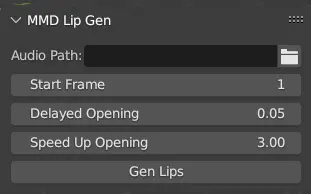

# whisky_helper_for_blender

Other languages: [简体中文](README_zh.md), (Currently unable to translate more)

A Blender plugin that can recognize lip movements through the vosk model and generate keyframes, along with some small
features I personally often use.

You can download the latest version from the Github Release page. Due to embedded open-source tools, it currently only
supports the Windows platform.

<!-- TOC -->
* [whisky_helper_for_blender](#whisky_helper_for_blender)
  * [Features](#features)
    * [MMD Lip Sync Generation](#mmd-lip-sync-generation)
      * [Usage](#usage)
      * [Parameter Introduction](#parameter-introduction)
    * [Other Features](#other-features)
  * [Support](#support)
    * [Blender Version Compatibility](#blender-version-compatibility)
    * [Operating System Compatibility](#operating-system-compatibility)
  * [How to Install Blender Add-ons in Higher Versions](#how-to-install-blender-add-ons-in-higher-versions)
  * [Open Source References](#open-source-references)
<!-- TOC -->

## Features

### MMD Lip Sync Generation

Recognizes phonetic lip movements through the Vosk audio model and adds them to MMD standard models.

The lip shape keys recognized by this plugin for MMD models are: あ, い, う, え, お. If any of these (except あ) are
missing, they will be changed to あ. If あ is not present, an error will be reported.

In fact, this plugin could be made more general and user-friendly, but due to limited time, it is not.

#### Usage

1. Select an audio file in the Audio Path.
2. Select any parent layer of an MMD model (note that if the object has multiple meshes containing these shape keys, all
   shape keys of the meshes will be modified).
3. It is recommended to open the system console to observe the progress. (Blender menu bar -> Windows -> Toggle System
   Console)
4. Set the parameters and click Generate (note that the current version will generate some readable cache files in the
   same directory as the audio file and will not clear them).
5. Wait for the mouse pointer to return to normal from the numeric state.

#### Parameter Introduction

Start Frame: The starting frame.
Delayed Opening: The buffer between phoneme recognition and mouth opening. The smaller the value, the faster the mouth
opens. It is not recommended to set it below 0.03.
Speed Up Opening: The larger the value, the faster the mouth opens and the slower it closes.

### Other Features

Documentation in progress...

## Support

### Blender Version Compatibility

- Mainly supported versions (tested by me):
    - 3.6, 4.2
- Potentially runnable versions:
    - Versions greater than or equal to 3.6
- Planned supported versions:
    - The next Blender LTS version
- Not planning to support:
    - Versions less than 3.6 and any non-LTS versions

### Operating System Compatibility

- Currently supported:
    - windows-x64
- Planned support:
    - macos-arm64 (I currently do not have a Mac device)
- Not planning to support:
    - linux (unless there is a major change, it is not planned to be supported)

## How to Install Blender Add-ons in Higher Versions

Reference: https://docs.blender.org/manual/en/4.2/editors/preferences/addons.html#prefs-extensions-install-legacy-addon

## Open Source References

| Project                    | Link                                         | License                                                                                      |
|----------------------------|----------------------------------------------|----------------------------------------------------------------------------------------------|
| FFmpeg                     | https://github.com/FFmpeg/FFmpeg             | GPLv3 (The embedded tools in Releases follow this license, no ffmpeg code in the repository) |
| Vosk-API and Vosk AI Model | https://github.com/alphacep/vosk-api         | Apache-2.0                                                                                   |
| CMU Dict                   | http://www.speech.cs.cmu.edu/cgi-bin/cmudict | 2-Clause BSD License                                                                         |
| gout-vosk tool             | https://github.com/skys-mission/gout         | GPLv3                                                                                        |
