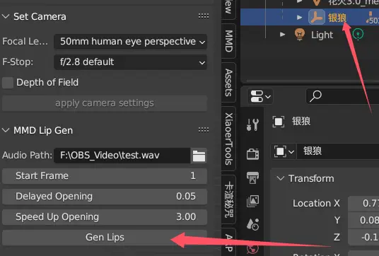
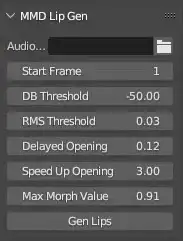
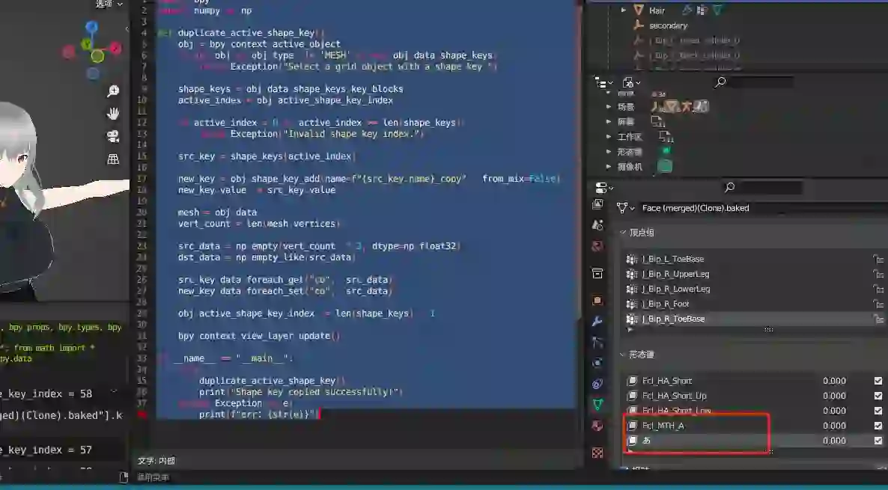

# whisky_helper_for_blender

他の言語：[English](README.md), [简体中文](README.zh-CN.md)

Blender用アドオンです。Voskモデルを使用して口の動きを認識しキーフレームを生成、ランダムな瞬きの作成、その他個人用の便利機能を提供します。

最新版はGithub Releaseページからダウンロード可能です。Windows-x64、macOS-arm64をサポート。

<!-- TOC -->
* [whisky_helper_for_blender](#whisky_helper_for_blender)
  * [ダウンロード](#ダウンロード)
  * [機能](#機能)
    * [MMD用口形生成](#mmd用口形生成)
      * [使用方法](#使用方法)
      * [パラメータ説明](#パラメータ説明)
      * [他のモデルへの対応方法](#他のモデルへの対応方法)
    * [ランダムな瞬き](#ランダムな瞬き)
    * [その他機能](#その他機能)
  * [サポート](#サポート)
    * [Blenderバージョン対応](#blenderバージョン対応)
    * [OS対応](#os対応)
  * [新しいバージョンでのアドオンインストール方法](#新しいバージョンでのアドオンインストール方法)
  * [本アドオン開発について](#本アドオン開発について)
    * [注意事項](#注意事項)
  * [オープンソース引用](#オープンソース引用)
<!-- TOC -->

## ダウンロード

https://github.com/skys-mission/whisky_helper_for_blender/releases

## 機能

### MMD用口形生成

Vosk音声モデルで音素を認識し、MMD標準モデルに口形を追加します

本アドオンが認識するMMDモデルの口形モーフ名：あ、い、う、え、お、ん。「あ」以外がない場合は全て「あ」に変換され、「あ」もない場合はエラーになります。

警告：この機能はオーディオ時間範囲内のあ、い、う、え、お、んモーフのキーフレームを上書きします

#### 使用方法

1. Audio Pathでオーディオファイルを選択（mp4を含む一般的なオーディオ形式が使用可能）
2. MMDモデルの任意の親階層を選択（複数のメッシュにこれらのモーフが含まれる場合、全てのメッシュが変更されます）
3. 進捗確認のためシステムコンソールを開くことを推奨（Mac版Blenderでは不可。メニュー→Window→Toggle System Console）
4. パラメータ設定後、生成をクリック
5. マウスポインタが数字から通常に戻るまで待機

#### パラメータ説明

- Start Frame: オーディオ開始フレーム
- DB Threshold: DBノイズ除去閾値（認識精度が低い場合は上げ、認識されない場合は下げる）
- RMS Threshold: RMSノイズ除去閾値（認識精度が低い場合は上げ、認識されない場合は下げる）
- Delayed Opening: 口開き遅延比率
- Speed Up Opening: 認識開始から遅延開口までのカーブ速度調整
- Max Morph Value: モーフの最大値

#### 他のモデルへの対応方法

VRMなど他のモデルでは、A/E/I/O/U/Nモーフを探すか自作し、MMD標準モーフ名に変更してください

**「あ」モーフが最低1つ必要です**

- あ = A
- い = I
- う = U
- え = E
- お = O
- ん = N

モーフのコピー方法は[copy_shape_key.md](docs/copy_shape_key.md)を参照

モデル出典：KissshotSusu

### ランダムな瞬き

「まばたき」モーフを認識します。ない場合は変換または作成が必要です

警告：この機能はフレーム範囲内のまばたきモーフキーフレームを上書きします

1. MMDモデルの任意の親階層を選択
2. システムコンソールで進捗確認を推奨
3. パラメータ設定後、生成をクリック
4. マウスポインタが数字から通常に戻るまで待機

- blink interval: 瞬き間隔（秒単位）
- blinking wave ratio: ランダム比率（0.01-1で調整）

### その他機能

ドキュメント作成中...

## サポート

### Blenderバージョン対応

- メインサポートバージョン（テスト済み）
    - 3.6, 4.2
- 動作可能性のあるバージョン
    - 3.6以上
- 計画中のサポートバージョン
    - 次のBlender LTSバージョン
- サポート予定なし
    - 3.6未満

### OS対応

- 現在サポート
    - Windows-x64
    - macOS-arm64
- サポート予定なし
    - Linux（重大な変更がない限り）

## 新しいバージョンでのアドオンインストール方法

参照：https://docs.blender.org/manual/ja/latest/editors/preferences/addons.html#prefs-extensions-install-legacy-addon

## 本アドオン開発について

### 注意事項

- Blender 3.6-4.4ではnumbaライブラリ（バージョン<=0.60.0）が必要な場合あり（他のバージョンは未確認）

## オープンソース引用

| プロジェクト                     | リンク                                               | ライセンス                                   |
|------------------------------|--------------------------------------------------|------------------------------------------|
| FFmpeg                       | https://github.com/FFmpeg/FFmpeg                 | GPLv3（Releasesに組み込まれたツールのライセンス、リポジトリ内にFFmpegコードは含まれず） |
| ~~Vosk-APIとVosk AI Model~~   | ~~https://github.com/alphacep/vosk-api~~         | Apache-2.0                               |
| ~~CMU Dict~~                 | ~~http://www.speech.cs.cmu.edu/cgi-bin/cmudict~~ | 2-Clause BSD License                     |
| ~~gout-vosk tool~~           | ~~https://github.com/skys-mission/gout~~         | GPLv3                                    |