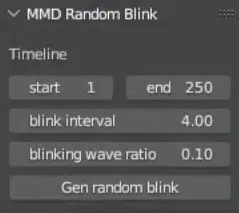

# half_bottled_blender_plugin

他の言語：[English](README.md), [简体中文](README_zh.md)

Blenderのアニメーション動画愛好家が作成したBlender用アドオンです。主な機能：MMD口形生成（拡張予定）、MMDまばたき生成などの機能。

名称変更予定：half_bottled_blender_plugin、関連機能の最適化とイテレーション更新を予定。

元々：whisky_helper_for_blenderプラグインで、主にMMDモデルの口形キーフレームの生成に使用されていました。

実際には、以前MMD動画を作成していた時に自分で作った小さなツールで、自分がよく使う機能がいくつか含まれているかもしれませんが、今後は開発・メンテナンスを継続するかどうかは分かりません。

<!-- TOC -->
* [half_bottled_blender_plugin](#half_bottled_blender_plugin)
  * [ダウンロード](#ダウンロード)
  * [機能](#機能)
    * [MMD口形生成](#mmd口形生成)
      * [使用方法](#使用方法)
      * [パラメータ説明](#パラメータ説明)
      * [他のモデルへの適応方法](#他のモデルへの適応方法)
    * [ランダムまばたき](#ランダムまばたき)
    * [その他の機能](#その他の機能)
  * [サポート](#サポート)
    * [Blenderバージョン互換性](#blenderバージョン互換性)
    * [オペレーティングシステム互換性](#オペレーティングシステム互換性)
  * [新バージョンでのBlenderプラグインのインストール方法](#新バージョンでのblenderプラグインのインストール方法)
  * [このプラグインの開発について](#このプラグインの開発について)
    * [注意事項](#注意事項)
  * [オープンソースリファレンス](#オープンソースリファレンス)
<!-- TOC -->

## ダウンロード

https://github.com/skys-mission/half_bottled_blender_plugin/releases

## 機能

### MMD口形生成

Vosk音声モデルを通じて音素の口形を認識し、MMD標準モデルに追加します。

本プラグインが認識するMMDモデルの口形モーフキー名：あ、い、う、え、お、ん。あ以外がない場合はすべてあに変更され、あがない場合はエラーになります。

警告：この機能は音声時間範囲内のあ、い、う、え、お、んモーフキーフレームを上書きします。

#### 使用方法

1. Audio Pathで音声ファイルを選択（一般的な音声ファイルは大概使用可能、mp4を含む）
2. MMDモデルの任意の階層の親を選択（注意：オブジェクト下にこれらのモーフキーを含む複数のメッシュがある場合、すべてのメッシュのモーフキーが変更されます）
3. システムコンソールを開いて進捗を確認することを推奨します。Mac版Blenderにはこの機能がありません。（Blenderメニューバー->windows->Toggle System Console）
4. パラメータを設定し、生成をクリック（~~現在のバージョンでは音声ファイルと同じディレクトリに読み取り可能なキャッシュファイルが生成され、クリアされないことに注意してください~~）
5. マウスポインタが数字から通常に戻るまで待機

#### パラメータ説明

- Start Frame: 音声がどのフレームから始まるか
- DB Threshold: DBノイズリダクション、認識が不正確な場合は上げる、認識できない場合は下げる
- RMS Threshold: RMSノイズリダクション、認識が不正確な場合は上げる、認識できない場合は下げる
- Delayed Opening: 遅延口開き比率
- Speed Up Opening: 認識開始から遅延口開きまでのカーブ速度調整パラメータ
- Max Morph Value: モーフキーの最大閾値

#### 他のモデルへの適応方法

例えばVRMの場合、モデルのA、E、I、O、U、Nのモーフキーを見つけるか設定し、MMD標準モーフキー名にコピーして変更する必要があります。

**本機能を使用するには少なくともあが必要です**

- あ = A
- い = I
- う = U
- え = E
- お = O
- ん = N

コピー方法が分からない場合は参考：[copy_shape_key.md](docs/copy_shape_key.md)

モデル出典：KissshotSusu

### ランダムまばたき

ランダムまばたきはまばたきのモーフキーを認識します。存在しない場合は自分でこのモーフキーを変換または作成する必要があります。

警告：この機能はフレーム範囲内のまばたきモーフキーフレームを破壊します。

1. MMDモデルの任意の階層の親を選択（注意：オブジェクト下にこれらのモーフキーを含む複数のメッシュがある場合、すべてのメッシュのモーフキーが変更されます）
2. システムコンソールを開いて進捗を確認することを推奨します。（Blenderメニューバー->windows->Toggle System Console）
3. パラメータを設定し、生成をクリック
4. マウスポインタが数字から通常に戻るまで待機

- blink interval: まばたき間隔、単位秒
- blinking wave ratio: ランダム比率0.01-1で調整可能

### その他の機能

ドキュメント作成中...

## サポート

### Blenderバージョン互換性

- 主要サポートバージョン（本人がテスト実施）
    - 3.6、4.2
- 動作可能性のあるバージョン
    - 3.6以上
- サポート予定のバージョン
    - 次のBlender LTSバージョン
- サポート予定なし
    - 3.6未満

### オペレーティングシステム互換性

- 現在サポート
    - windows-x64
- サポート可能性あり
    - macos-arm64
- サポート予定なし
    - linux（重大な変更がない限りサポート予定なし）

## 新バージョンでのBlenderプラグインのインストール方法

参考：https://docs.blender.org/manual/ja/4.2/editors/preferences/addons.html#prefs-extensions-install-legacy-addon

## このプラグインの開発について

### 注意事項

- blender3.6-4.4ではnumbaライブラリが必要な場合があります：バージョン<=0.60.0（その他のBlenderバージョンは未確認）

## オープンソースリファレンス

| プロジェクト | リンク | ライセンス |
|----------------------------|--------------------------------------------------|----------------------------------------|
| FFmpeg | https://github.com/FFmpeg/FFmpeg | GPLv3（Releasesに埋め込まれたツールはこのライセンスを使用、リポジトリにはffmpegコードなし） |
| ~~Vosk-APIとVosk AI Model~~ | ~~https://github.com/alphacep/vosk-api~~ | Apache-2.0 |
| ~~CMU Dict~~ | ~~http://www.speech.cs.cmu.edu/cgi-bin/cmudict~~ | 2-Clause BSD License |
| ~~gout-vosk tool~~ | ~~https://github.com/skys-mission/gout~~ | GPLv3 |