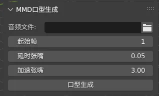

# whisky_helper_for_blender

其它语言：[English](README.md), (Currently unable to translate more)

一个Blender插件，可以通过vosk模型识别口型动作并生成关键帧，还有一些我个人常用的小功能。

可以在Github Release页面下载最新版本。因为内嵌一些开源工具。所以目前仅支持Windows平台。

<!-- TOC -->
* [whisky_helper_for_blender](#whisky_helper_for_blender)
  * [Download](#download)
  * [功能](#功能)
    * [MMD口型生成](#mmd口型生成)
      * [使用方法](#使用方法)
      * [参数介绍](#参数介绍)
    * [其它功能](#其它功能)
  * [支持](#支持)
    * [Blender版本适配](#blender版本适配)
    * [操作系统适配](#操作系统适配)
  * [高版本如何安装Blender插件](#高版本如何安装blender插件)
  * [开源引用](#开源引用)
<!-- TOC -->

## Download

https://github.com/skys-mission/whisky_helper_for_blender/releases

## 功能

### MMD口型生成

通过Vosk 音频模型识别出音素口型，添加到MMD标准模型上

本插件识别的MMD模型的口型形态键名：あ，い，う，え，お。除了あ以外没有的全部改到あ上，如果没有あ则报错。

实际上这个插件可以做的更通用和更好用，但奈何我时间有限

#### 使用方法

1. 在Audio Path中选择一个音频文件
2. 选中一个mmd模型的任意层父级（注意，如果对象下有多个网格体包含这些形态键，则所有网格体的形态键均会被修改）
3. 建议打开系统控制台观察进度。（Blender菜单栏->windows->Toggle System Console）
4. 设置参数，点击生成（注意当前版本会在音频文件同级目录生成一些可读的缓存文件，不会清除）
5. 等待鼠标指针从数字恢复成正常

#### 参数介绍

起始帧：起始帧
延时张嘴：音素到张嘴中的缓冲，越小张嘴越快，不建议小于0.03
加速张嘴：越大张嘴越快，闭嘴越慢

### 其它功能

文档编写中...

## 支持

### Blender版本适配

- 主要支持的版本（本人会进行测试）
    - 3.6 ，4.2
- 或许可以运行的版本
    - 大于等于3.6
- 计划支持的版本
    - 下一个Blender LTS版本
- 不计划适配
    - 小于3.6和任何不是LTS的版本

### 操作系统适配

- 当前支持
    - windows-x64
- 计划支持
    - macos-arm64 (本人手上暂无Mac设备)
- 不计划支持
    - linux（除非出现重大变故，否则不计划支持）

## 高版本如何安装Blender插件

参考：https://docs.blender.org/manual/zh-hans/4.2/editors/preferences/addons.html#prefs-extensions-install-legacy-addon

## 开源引用

| 项目                         | 链接                                             | 协议                                     |
|----------------------------|------------------------------------------------|----------------------------------------|
| FFmpeg                     | https://github.com/FFmpeg/FFmpeg               | GPLv3（Releases中内嵌的工具采用协议，仓库中无ffmpeg代码） |
| ~~Vosk-API和Vosk AI Model~~ | ~~https://github.com/alphacep/vosk-api~~       | Apache-2.0                             |
| CMU Dict                   | ~~http://www.speech.cs.cmu.edu/cgi-bin/cmudict | 2-Clause BSD License                   |
| ~~gout-vosk tool~~         | ~~https://github.com/skys-mission/gout~~       | GPLv3                                  |
